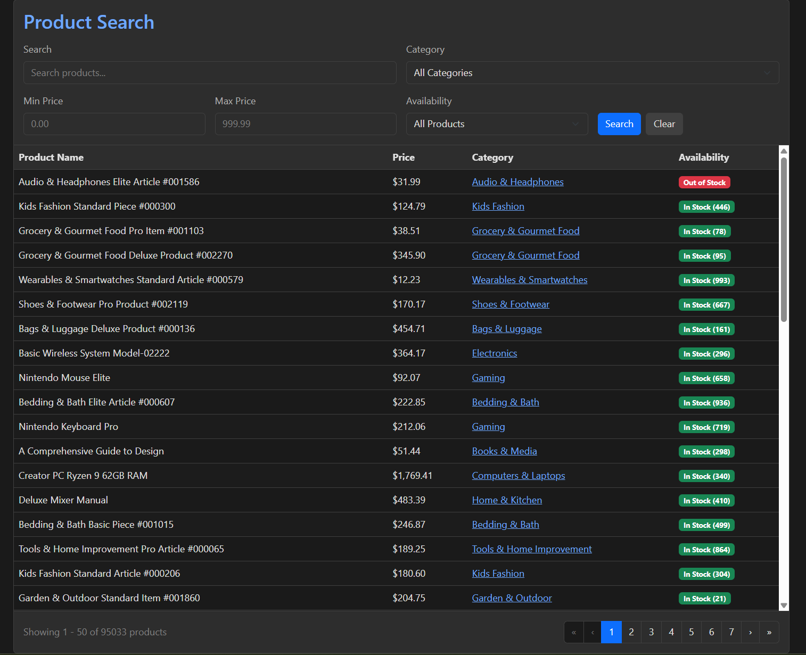

# Practice Application

A full-stack product management application built with .NET Core Web API and Angular, featuring a searchable product catalog with category management and pagination.


*Dark-themed product search interface with advanced filtering and pagination*

## Quick Start

### Prerequisites

- .NET 8.0 SDK or later
- Node.js 18+ and npm
- PostgreSQL 14+
- Git

### Setup and Run Instructions

1. **Database Setup**

   ```bash
   # Navigate to database directory
   cd database

   # Create .env file with your PostgreSQL credentials
   # look at .example.env
   # POSTGRES_USER=your_username
   # POSTGRES_PASSWORD=your_password
   # POSTGRES_DB=practicedb

   # Run migrations (from api/PracticeApi directory)
   cd ../api/PracticeApi
   dotnet ef database update

   # run seed scripts found under database/scripts
   ```

2. **Run API**

   ```bash
   cd api/PracticeApi
   dotnet run
   # API will be available at http://localhost:5258
   ```

3. **Run Client**
   ```bash
   cd client
   npm install
   npm start
   # Client will be available at http://localhost:4200
   ```

## Architecture

### Overall Architecture Approach

The application follows a **layered architecture** with clear separation of concerns:

- **API Layer**: RESTful Web API controllers handling HTTP requests
- **Service Layer**: Business logic and data access via Entity Framework Core
- **Data Layer**: PostgreSQL database with EF Core as ORM
- **Client Layer**: Angular SPA with component-based architecture and signal-based state management

### Database Schema

**Products Table**

- Primary entity containing product information
- Foreign key relationship to Categories
- Indexed on `CategoryId` and `IsActive` for query optimization

**Categories Table**

- Lookup table for product categorization
- Contains name, description, and active status

**Key Design Decisions:**

- Separate `IsActive` flags on both tables for soft deletion
- `CreatedDate` on products for audit trail
- Foreign key with optional relationship (products can exist without categories)

### Technology Choices

**Backend:**

- **.NET 8 Web API**: Modern, performant framework with built-in dependency injection
- **Entity Framework Core**: Type-safe ORM with LINQ query capabilities
- **PostgreSQL**: Robust open-source relational database with excellent performance
- **DotNetEnv**: Environment variable management for secure configuration

**Frontend:**

- **Angular 19**: Modern framework with standalone components and signals
- **TypeScript**: Type safety and better developer experience
- **Bootstrap 5**: Responsive UI components with dark theme customization
- **RxJS**: Reactive programming for HTTP requests and state management

## Design Decisions

### Single Responsibility Principle (SRP)

**Applied throughout the application:**

1. **Controllers**: Only handle HTTP concerns (request/response, validation, status codes)

   - `ProductController`: Routes product-related requests
   - `CategoryController`: Routes category-related requests

2. **Services**: Separated into focused responsibilities

   - `ProductHttpService` (Angular): Pure HTTP operations
   - `ProductService` (Angular): State management with signals
   - Repository pattern considered but intentionally omitted (see below)

3. **Components**: Each has a single, well-defined purpose
   - `ProductListComponent`: Display products
   - `ProductSearchHeaderComponent`: Search form logic
   - `ProductPaginationFooterComponent`: Pagination controls
   - `CategoryDetailModalComponent`: Category detail display

### Dependency Inversion Principle (DIP)

**Implemented via:**

1. **Dependency Injection**: All services injected through constructors

   ```csharp
   public ProductController(AppDbContext context) // Depends on abstraction
   ```

2. **Interface-based Models**: TypeScript interfaces define contracts

   ```typescript
   export interface Product { ... }
   export interface PaginatedResult<T> { ... }
   ```

3. **Service Abstraction**: Angular services provide abstraction over HTTP concerns
   - Components depend on `ProductService`, not HTTP implementation details

### EF Core Approach and Query Optimization

**Strategy:**

- **Direct DbContext usage** in controllers instead of repository pattern
- **LINQ queries** for type safety and readability
- **Eager loading** with `.Include()` for related data to avoid N+1 queries
- **IQueryable composition** for building complex queries dynamically

**Example optimization:**

```csharp
var query = _context.Products
    .Include(p => p.Category)  // Eager load to prevent N+1
    .Where(p => p.IsActive);   // Filter at database level
```

### Complex Endpoint Choice and Rationale

**Product Search Endpoint (`/api/product/search`)**

Chosen as the complex endpoint because it demonstrates:

1. **Dynamic query building** based on optional parameters
2. **Multiple filter conditions** (text search, category, price range, stock status)
3. **Pagination logic** with calculated metadata
4. **LINQ composition** for flexible querying
5. **Related data loading** (categories)

**Rationale:**

- Real-world complexity: Most applications need flexible search
- Performance considerations: Pagination prevents large result sets
- Query optimization: Demonstrates proper use of IQueryable
- Business logic: Multiple filter combinations require careful implementation

### Repository Pattern Decision and Trade-offs

**Decision: Did NOT implement repository pattern**

**Rationale:**

- **EF Core is already a repository/unit of work**: DbContext provides these patterns
- **Avoid over-abstraction**: Repository over EF Core adds unnecessary layer
- **LINQ benefits**: Direct DbContext access preserves full LINQ capabilities
- **Simplicity**: Fewer abstractions mean easier maintenance for small-medium projects

**Trade-offs:**

- ✅ **Pros**: Less code, better testability with in-memory database, full EF features
- ❌ **Cons**: Controllers coupled to EF Core, harder to swap ORMs (rare requirement)

**When I would use Repository Pattern:**

- Multiple data sources (SQL + NoSQL)
- Complex business logic requiring transaction orchestration
- Large enterprise applications with many developers
- Need to swap ORMs (unlikely with modern EF Core)

### Index Strategy

**Indexes Created:**

```csharp
modelBuilder.Entity<Product>()
    .HasIndex(p => p.CategoryId);  // Foreign key lookups

modelBuilder.Entity<Product>()
    .HasIndex(p => p.IsActive);    // Soft delete filtering
```

**Rationale:**

- `CategoryId`: Frequent filtering by category in search queries
- `IsActive`: Every query filters active records
- No composite index on `(CategoryId, IsActive)` yet - would add if query patterns show need

**Not Indexed:**

- `Name`: Text search uses `EF.Functions.ILike()` which benefits less from standard indexes
- `Price`: Range queries on price are less frequent
- Future consideration: Full-text search index for product name/description

## What I Would Do With More Time

### Unimplemented Features and Approach

1. **Full CRUD Operations**

   - Add create/update/delete endpoints for products and categories
   - Implement form validation and error handling
   - Add confirmation modals for delete operations

2. **Authentication & Authorization**

   - JWT-based authentication
   - Role-based access control (Admin vs. User)
   - Secure endpoints with `[Authorize]` attributes

3. **Advanced Search Features**

   - Full-text search using PostgreSQL FTS
   - Saved searches/filters
   - Search history

4. **Real-time Updates**

   - SignalR for real-time product updates
   - Stock quantity notifications
   - WebSocket connections for collaborative features

5. **API Versioning**
   - Implement versioning strategy (URL or header-based)
   - Support multiple API versions simultaneously

### Refactoring Priorities

1. **Validation Layer**

   - Add FluentValidation for complex validation rules
   - DTOs for request/response separation
   - Custom validation attributes

2. **Error Handling Middleware**

   - Global exception handler
   - Consistent error response format
   - Logging integration (Serilog)

3. **Service Layer**

   - Extract business logic from controllers
   - `IProductService` interface for testability
   - Separate command/query concerns (CQRS-lite)

4. **Caching Strategy**

   - Redis for frequently accessed categories
   - Response caching for static product data
   - Cache invalidation on updates

5. **Testing**
   - Unit tests for business logic
   - Integration tests for API endpoints
   - E2E tests for critical user flows

### Production Considerations

1. **Performance**

   - Add response compression
   - Implement API rate limiting
   - Database connection pooling optimization
   - CDN for static assets

2. **Monitoring & Observability**

   - Application Insights or similar APM
   - Structured logging with correlation IDs
   - Health check endpoints
   - Performance metrics and alerting

3. **Security**

   - HTTPS enforcement
   - CORS policy refinement
   - SQL injection prevention (already using parameterized queries)
   - Input sanitization
   - Security headers (HSTS, CSP, etc.)

4. **DevOps**

   - Docker containerization
   - CI/CD pipeline (GitHub Actions or Azure DevOps)
   - Infrastructure as Code (Terraform)
   - Database migration strategy for production

5. **Data Management**
   - Backup and recovery procedures
   - Data retention policies
   - GDPR compliance considerations
   - Database migration rollback strategy

## Assumptions & Trade-offs

### Key Assumptions Made

1. **Product Uniqueness**: Products are unique by ID, not by name
2. **Category Requirement**: Products can exist without a category (optional relationship)
3. **Soft Deletes**: Both products and categories use `IsActive` flag instead of hard deletes
4. **Pagination**: Default 50 items per page balances performance and UX
5. **Search Behavior**: Text search is case-insensitive and matches partial strings
6. **Currency**: All prices assumed to be in USD (no multi-currency support)
7. **Stock Quantity**: Simple integer count, no warehouse location or variants
8. **User Context**: No multi-tenancy - single organization/database

### Trade-offs in Design

1. **Direct DbContext vs Repository Pattern**

   - **Chose**: Direct DbContext
   - **Trade-off**: Faster development, less abstraction vs. harder to test/swap implementations
   - **Justification**: EF Core provides sufficient abstraction for this application size

2. **Eager Loading vs Lazy Loading**

   - **Chose**: Explicit eager loading with `.Include()`
   - **Trade-off**: More explicit code vs. risk of N+1 queries
   - **Justification**: Better performance control and predictability

3. **Pagination on Backend vs Frontend**

   - **Chose**: Backend pagination
   - **Trade-off**: More API calls vs. large initial payload
   - **Justification**: Scales better with large datasets, reduces bandwidth

4. **Signal-based State vs NgRx**

   - **Chose**: Angular signals for state management
   - **Trade-off**: Simpler code vs. less structured state management
   - **Justification**: Appropriate for application complexity, leverages Angular 19 features

5. **In-line Styles vs Separate CSS**

   - **Chose**: Mix of component styles and global dark theme
   - **Trade-off**: Quick development vs. maintainability
   - **Justification**: Rapid prototyping, acceptable for smaller applications

6. **DTOs vs Domain Models**

   - **Chose**: Expose domain models directly through API
   - **Trade-off**: Faster development vs. tight coupling between API and database
   - **Justification**: Acceptable for MVP, would refactor for production

7. **Index Strategy**

   - **Chose**: Minimal indexes (CategoryId, IsActive)
   - **Trade-off**: Faster writes vs. potentially slower complex queries
   - **Justification**: Can add indexes based on actual query patterns in production

8. **Error Handling**
   - **Chose**: Basic try-catch in controllers
   - **Trade-off**: Simple implementation vs. detailed error information
   - **Justification**: Sufficient for development, would add middleware for production

---

## Project Structure

```
practiceApp/
├── api/
│   └── PracticeApi/          # .NET Web API
│       ├── Controllers/       # API endpoints
│       ├── Data/             # DbContext and migrations
│       ├── Models/           # Entity models
│       └── Program.cs        # Application entry point
├── client/
│   └── src/
│       ├── app/
│       │   └── components/   # Angular components
│       ├── models/           # TypeScript interfaces
│       ├── services/         # HTTP and state services
│       └── styles.scss       # Global dark theme styles
├── database/
│   └── .env                  # Database credentials (not in repo)
└── README.md                 # This file
```

## License

This is a practice/learning project. Feel free to use as reference.
